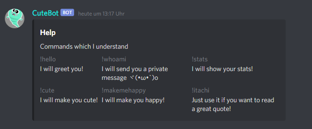
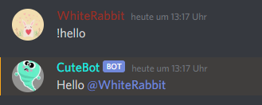
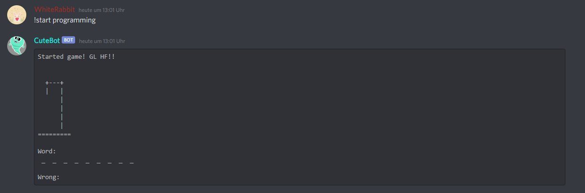
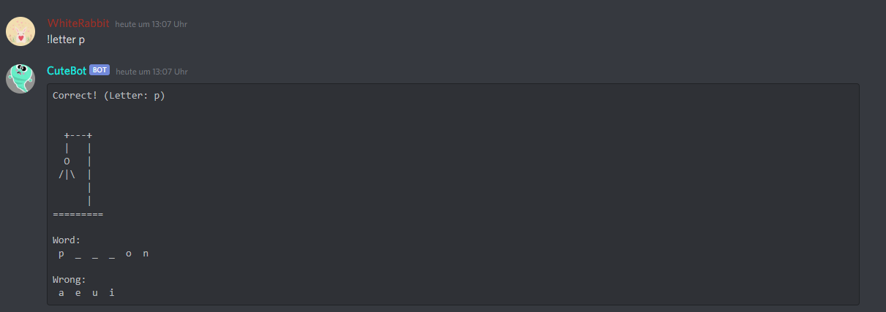
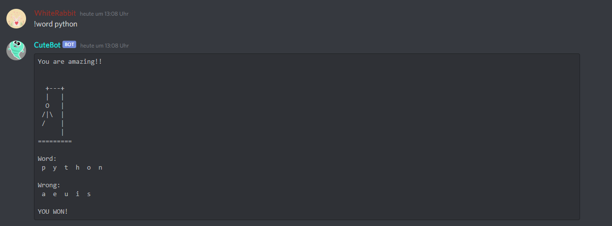
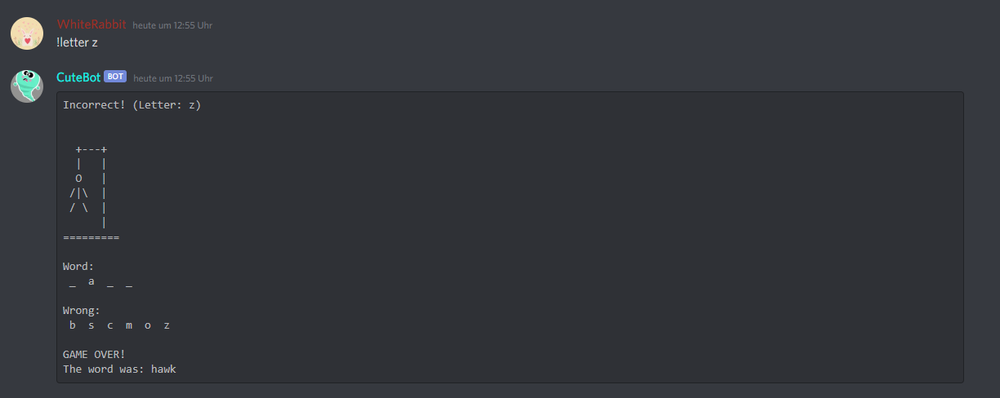

# CuteBot
CuteBot is a bot which improves our discord server. To interact easily with the discord API I have used ["discord.py"](https://discordpy.readthedocs.io/en/latest/).

CuteBot can be used to play games or just to have some fun. Every game needs a seperate Text Channel. Furthermore a Text Channel only for the CuteBot is needed.

# Commands in the CuteBot Text Channel


# Screenshots from the CuteBot Text Channel


# Games

## Hangman
You will need a seperate text channel for this game. (e.g. "Hangman")

### Commands
```
The Hangman Game:

!start [wordlist]     Starts the game
!restart [wordlist]   Restarts a running game
!wordlists            Prints all available wordlists
!stop                 Stops a running game
!letter [char]        Type this during a running game if you want to try a letter
!word [word]          Type this during a running game if you want to try a word
!help                 Prints this help menu
```

### Screenshots




